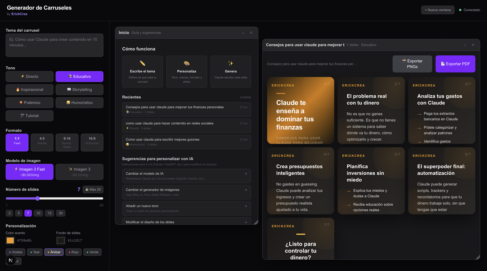

# Generador de Carruseles para Instagram

App web para generar carruseles de Instagram de forma automatica usando inteligencia artificial. Escribe un tema, personaliza el tono y los colores, y obten slides listos para publicar.

> **[Read this in English](README.en.md)**



https://github.com/EriMCrea/carousel-generator/assets/demo.mp4

## Que hace

- Genera contenido para carruseles de Instagram con IA (Claude de Anthropic)
- 7 tonos de escritura: Directo, Educativo, Inspiracional, Storytelling, Polemico, Humoristico, Tutorial
- 4 formatos de slide: 1:1 (Feed), 4:5 (Retrato), 9:16 (Stories/Reels), 16:9 (Horizontal)
- Personaliza colores de acento y fondo con 6 presets o colores custom
- Genera imagenes para cada slide con Google Gemini (opcional)
- Exporta como PNGs (ZIP) o PDF completo
- Sistema de ventanas: genera multiples carruseles sin perder los anteriores
- Estructura editable: controla que va en cada slide antes de generar

## Stack

- **Framework:** Next.js 16 (App Router, Turbopack)
- **Lenguaje:** TypeScript
- **Estilos:** Tailwind CSS
- **IA texto:** Claude (Anthropic)
- **IA imagen:** Google Gemini
- **Exportacion:** html2canvas + jsPDF + JSZip

## Instalacion

```bash
git clone https://github.com/EriMCrea/carousel-generator.git
cd carousel-generator
npm install
```

## Configurar API Keys

Crea un archivo de variables de entorno local en la raiz del proyecto. Puedes copiar la plantilla incluida (env.example) y renombrarla. Luego agrega tus keys:

```
ANTHROPIC_API_KEY=tu_api_key_de_anthropic
GEMINI_API_KEY=tu_api_key_de_google_gemini
```

Donde obtener las keys:
- Anthropic: https://console.anthropic.com/
- Google AI Studio: https://aistudio.google.com/apikey

> La key de Gemini es opcional. Sin ella, la app funciona perfectamente para generar texto, solo no podras generar imagenes con IA.

## Correr la app

```bash
npm run dev
```

Abre http://localhost:3000 en tu navegador.

## Como usar

1. Escribe el tema del carrusel
2. Selecciona el tono de escritura
3. Elige el formato (1:1, 4:5, 9:16, 16:9)
4. Ajusta el numero de slides (1-20, desbloqueable hasta 100)
5. Opcional: edita la estructura de cada slide
6. Click en "Generar carrusel"
7. Cada carrusel aparece en su propia ventana, puedes generar varios sin perder los anteriores
8. Exporta como PNGs (ZIP) o PDF

## Estructura del proyecto

```
carousel-generator/
  app/
    page.tsx                    <- Pagina principal y sistema de ventanas
    layout.tsx                  <- Layout global
    globals.css                 <- Estilos base (Tailwind)
    api/
      generate/route.ts         <- API: genera contenido con Claude
      generate-image/route.ts   <- API: genera imagenes con Gemini
  components/
    SlideCard.tsx               <- Diseno visual de cada slide
    DraggableWindow.tsx         <- Ventana movible/redimensionable
    StructureEditor.tsx         <- Editor de estructura del carrusel
    ExportPanel.tsx             <- Botones de exportacion (PNG/PDF)
  lib/
    types.ts                    <- Tipos TypeScript
    prompts.ts                  <- System/user prompts para Claude
    defaultStructure.ts         <- Estructura por defecto de slides
  env.example                  <- Plantilla de variables de entorno
  README.md                    <- Este archivo (espanol)
  README.en.md                 <- Version en ingles
```

## Seguridad

- Las API keys se leen desde variables de entorno del servidor (Next.js API routes)
- Nunca se exponen al navegador del usuario
- El archivo de entorno local esta en .gitignore y no se sube a GitHub
- No hay credenciales, tokens ni informacion personal en el codigo fuente

## Personalizar el proyecto

La app incluye una seccion de "Sugerencias para personalizar con IA" dentro de la ventana de inicio, con instrucciones paso a paso para:

- Cambiar el modelo de IA (usar OpenAI, Gemini, etc. en vez de Claude)
- Cambiar el generador de imagenes
- Agregar nuevos tonos de escritura
- Modificar el diseno visual de los slides
- Cambiar la marca/branding
- Crear nuevos presets de color

## Traducir el proyecto a otro idioma

Toda la interfaz esta en espanol. Para traducirla a ingles u otro idioma, consulta la seccion "Translating to another language" en el README en ingles (README.en.md).

### Archivos a traducir

1. **app/page.tsx** - Textos de la interfaz: labels, botones, placeholders, onboarding, sugerencias de IA
2. **lib/prompts.ts** - El system prompt y user prompt que se envian a Claude (esto define en que idioma escribe la IA)
3. **lib/defaultStructure.ts** - Las instrucciones por defecto de cada slide
4. **components/SlideCard.tsx** - El texto de la marca ("ErickCrea", "@erickcrea")
5. **components/ExportPanel.tsx** - Textos de los botones de exportacion
6. **components/StructureEditor.tsx** - Labels del editor de estructura
7. **app/api/generate/route.ts** y **app/api/generate-image/route.ts** - Mensajes de error del servidor

### Consejo

Dale estas instrucciones a tu IA (Claude, ChatGPT, etc.):

> "Traduce todos los strings de interfaz de espanol a [idioma] en los archivos mencionados arriba. Manten la estructura del codigo identica, solo cambia los textos visibles."

## Licencia

MIT

---

Hecho por [ErickCrea](https://github.com/EriMCrea)
